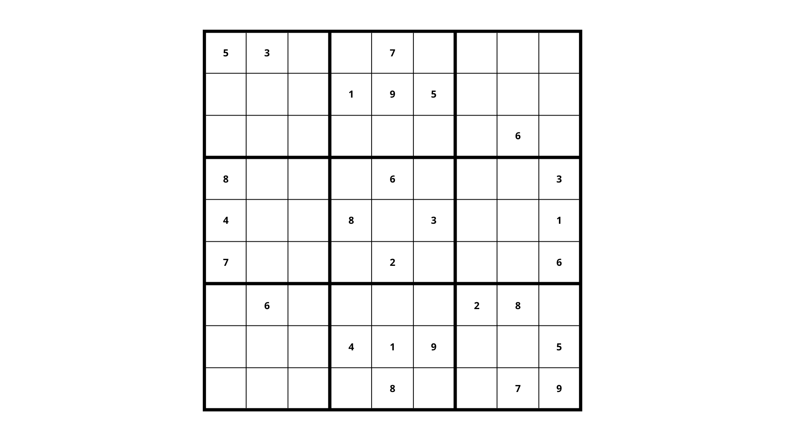
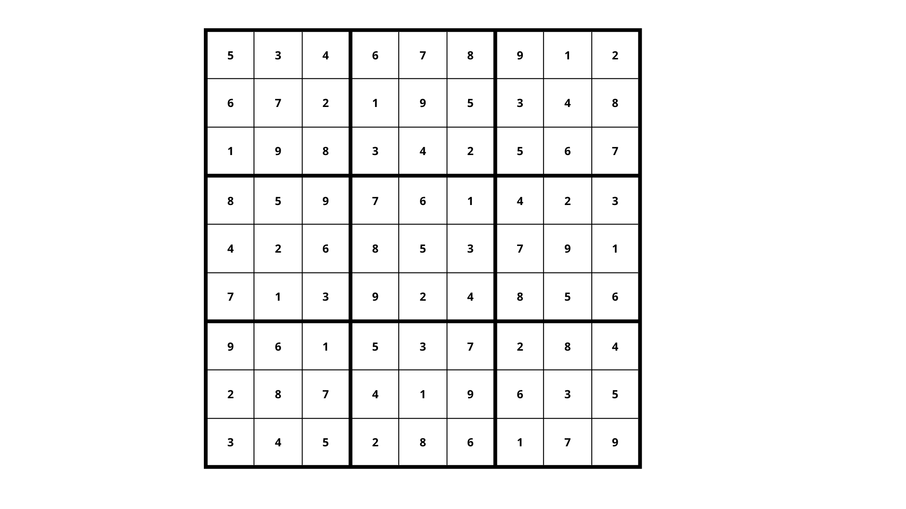

# 2026-crypt-ZeroKnowledgeProof

## What is Zero Knowledge Proof ?

A Zero-Knowledge Proof (ZKP) is a cryptographic protocol where a prover can convince a verifier that they know a secret (or that a statement is true) without revealing any information about the secret itself.

## Core properties

- **Completeness** : if the statment is true and both parties are honest, the verifier will be convinced.

- **Soundness** : a cheating prover cannot convinced the verifier of a false statement (exept with negligible probability).

- **Zero-knowledge** : the verifier learns nothing beyond the fact that the statement is true.

## Classic example : Sudoku

Imagine Alice has solved the following Sudoku puzzle. Bob wants to verify that Alice truly knows the solution, without Alice revealing it.

**The puzzle (public):**



**The solution (secret):**



### How the ZKP works

#### 1. Setup : Alice writes her solution on 81 cards, one per cell, and places them face down. The given clues (public inputs) remain visible.

```
 5  3  ?  | ?  7  ?  | ?  ?  ?
 ?  ?  ?  | 1  9  5  | ?  ?  ?
 ?  ?  ?  | ?  ?  ?  | ?  6  ?
-----------+-----------+-----------
 8  ?  ?  | ?  6  ?  | ?  ?  3
 4  ?  ?  | 8  ?  3  | ?  ?  1
 7  ?  ?  | ?  2  ?  | ?  ?  6
-----------+-----------+-----------
 ?  6  ?  | ?  ?  ?  | 2  8  ?
 ?  ?  ?  | 4  1  9  | ?  ?  5
 ?  ?  ?  | ?  8  ?  | ?  7  9
```
> Public clues are shown, the rest (`?`) are face-down cards.

---

#### 2. Commitment : Alice applies a secret random permutation to the digits (e.g. 1→4, 2→7, 3→1, …) across the whole grid, then covers **all** cells — including the clues.

```
 ?  ?  ?  | ?  ?  ?  | ?  ?  ?
 ?  ?  ?  | ?  ?  ?  | ?  ?  ?
 ?  ?  ?  | ?  ?  ?  | ?  ?  ?
-----------+-----------+-----------
 ?  ?  ?  | ?  ?  ?  | ?  ?  ?
 ?  ?  ?  | ?  ?  ?  | ?  ?  ?
 ?  ?  ?  | ?  ?  ?  | ?  ?  ?
-----------+-----------+-----------
 ?  ?  ?  | ?  ?  ?  | ?  ?  ?
 ?  ?  ?  | ?  ?  ?  | ?  ?  ?
 ?  ?  ?  | ?  ?  ?  | ?  ?  ?
```
> Alice is now *committed*: she cannot change her solution without Bob noticing, but Bob sees nothing yet.

---

#### 3. Challenge : Bob randomly picks one constraint to audit — a row, a column, or a 3×3 box. Here Bob picks **row 4**.

```
 ?  ?  ?  | ?  ?  ?  | ?  ?  ?
 ?  ?  ?  | ?  ?  ?  | ?  ?  ?
 ?  ?  ?  | ?  ?  ?  | ?  ?  ?
-----------+-----------+-----------
[?  ?  ?  | ?  ?  ?  | ?  ?  ?]  ← Bob challenges row 4
 ?  ?  ?  | ?  ?  ?  | ?  ?  ?
 ?  ?  ?  | ?  ?  ?  | ?  ?  ?
-----------+-----------+-----------
 ?  ?  ?  | ?  ?  ?  | ?  ?  ?
 ?  ?  ?  | ?  ?  ?  | ?  ?  ?
 ?  ?  ?  | ?  ?  ?  | ?  ?  ?
```

---

#### 4. Response : Alice flips the 9 cards of row 4. Bob checks that all digits 1–9 appear exactly once. Since Alice applied a permutation, the row still contains each digit exactly once — but in a shuffled order Bob cannot map back to the original.

```
 ?  ?  ?  | ?  ?  ?  | ?  ?  ?
 ?  ?  ?  | ?  ?  ?  | ?  ?  ?
 ?  ?  ?  | ?  ?  ?  | ?  ?  ?
-----------+-----------+-----------
 2  6  9  | 7  5  4  | 1  3  8   ← revealed (permuted)
 ?  ?  ?  | ?  ?  ?  | ?  ?  ?
 ?  ?  ?  | ?  ?  ?  | ?  ?  ?
-----------+-----------+-----------
 ?  ?  ?  | ?  ?  ?  | ?  ?  ?
 ?  ?  ?  | ?  ?  ?  | ?  ?  ?
 ?  ?  ?  | ?  ?  ?  | ?  ?  ?
```
> Bob verifies: {2,6,9,7,5,4,1,3,8} = {1…9} ✓ — but he cannot deduce the true values without knowing the secret permutation.

---

#### 5. Repeat : Alice discards the permuted cards and re-commits with a **fresh** random permutation. Bob picks a new constraint (here **box 9**). This loop runs many times.

```
 ?  ?  ?  | ?  ?  ?  | ?  ?  ?
 ?  ?  ?  | ?  ?  ?  | ?  ?  ?
 ?  ?  ?  | ?  ?  ?  | ?  ?  ?
-----------+-----------+-----------
 ?  ?  ?  | ?  ?  ?  | ?  ?  ?
 ?  ?  ?  | ?  ?  ?  | ?  ?  ?
 ?  ?  ?  | ?  ?  ?  | ?  ?  ?
-----------+-----------+-----------
 ?  ?  ?  | ?  ?  ?  |[?  ?  ?]
 ?  ?  ?  | ?  ?  ?  |[?  ?  ?]  ← Bob challenges box 9
 ?  ?  ?  | ?  ?  ?  |[?  ?  ?]
```
> After *n* rounds, the probability that a cheating prover was never caught falls to (26/27)ⁿ — negligible for large *n*.

### Why this is Zero-Knowledge

- **Completeness** : if Alice truly knows the solution, she always passes the check.
- **Soundness** : a cheating Alice would need to fake at least one constraint : the probability of never being caught drops exponentially with each round.
- **Zero-knowledge** : Bob only ever sees a random permutation of {1…9} in one constraint per round — he learns nothing about the actual placement of numbers.

This maps directly onto real ZKP systems: the puzzle is the **public statement**, the solution is the **witness**, and the protocol convinces the verifier without exposing the witness.

## Common ZKP systems

| System | Type | Notable use |
|--------|------|-------------|
| **Schnorr protocol** | Interactive | Identity proofs |
| **zk-SNARKs** | Non-interactive | Zcash, Ethereum L2s |
| **zk-STARKs** | Non-interactive | StarkNet, scalable proofs |
| **Bulletproofs** | Non-interactive | Confidential transactions |

## Real-world applications

- **Blockchain privacy** (Zcash, Tornado Cash)

- **Authentication** without password transmission

- **Age/identity verification** without revealing personal data

- **Rollups** (zkEVM) for blockchain scalability

---

In this project, we will be implementing two proof-of-concept demonstrations. The first one will emulate an **age/identity verification** and the second one will be the **password-free authentication**.

